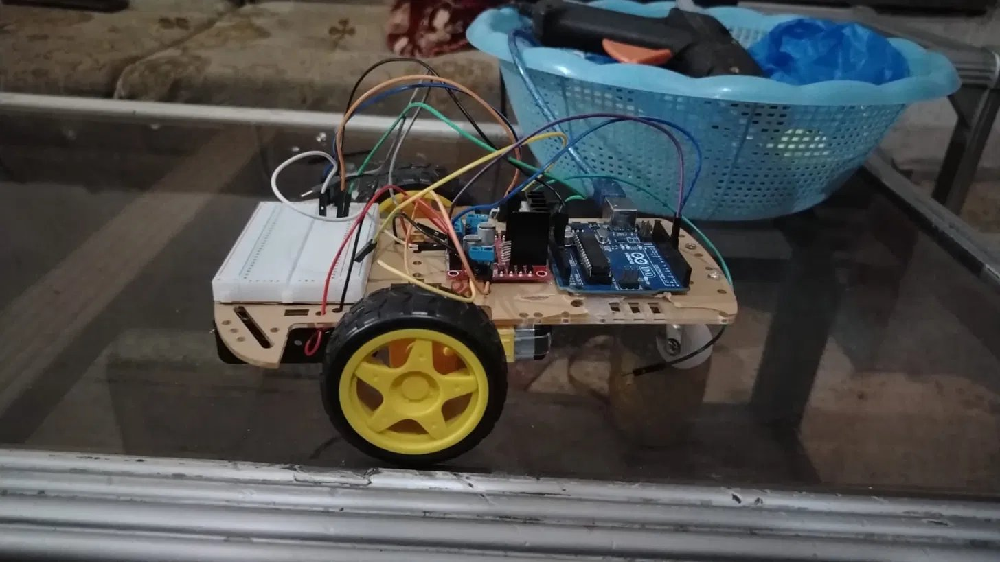

# Gesture & Bluetooth-Controlled Robot Car

Robot car controlled via gesture and voice commands, relayed over Bluetooth.

## Demo

## Hardware Used
- Arduino Uno
- L298N Motor Driver
- 2× DC Motors
- HC-05 Bluetooth Module
- 9V Battery

## How It Works
Gesture and voice commands are captured on a paired device and sent over Bluetooth
to the HC-05 module. Embedded C on the Arduino handles serial parsing, PWM signal
generation, and direction switching to drive the L298N motor driver in real time.

## Tech Stack
`Arduino Uno` `Embedded C` `L298N` `HC-05` `PWM`

## What I Learned
Getting reliable direction control meant carefully mapping each Bluetooth command
to the correct combination of IN1/IN2/IN3/IN4 states on the L298N — small wiring
or logic mistakes there show up immediately as a motor spinning the wrong way.
Working with PWM for speed control also meant balancing responsiveness against
smooth, controllable movement rather than jerky on/off motion.
